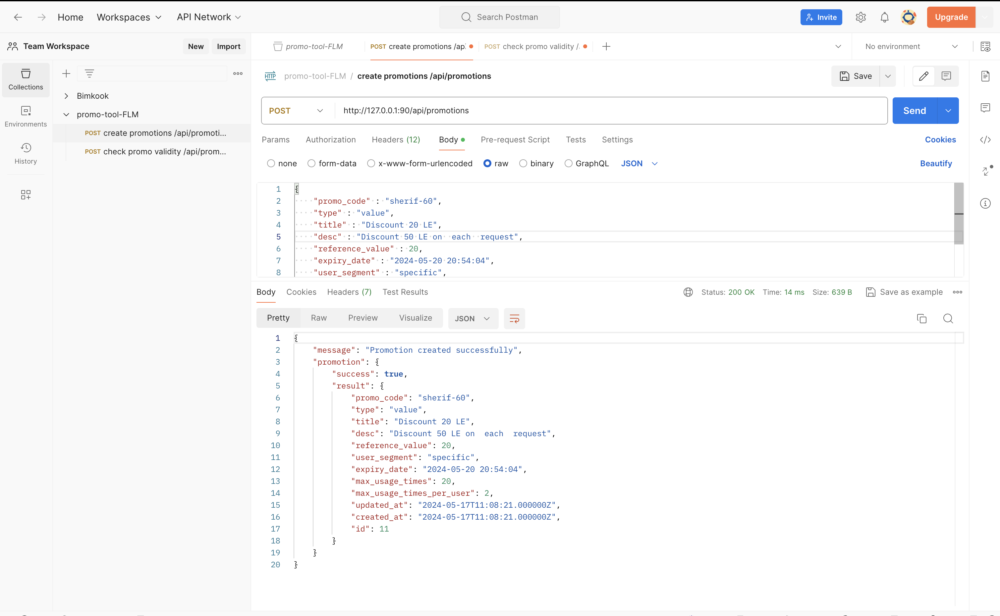
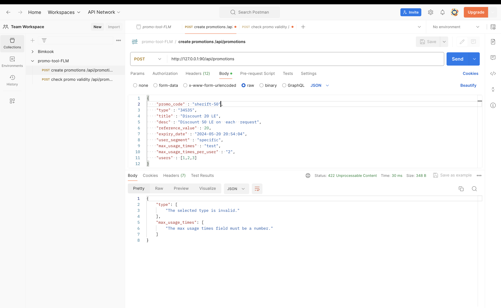
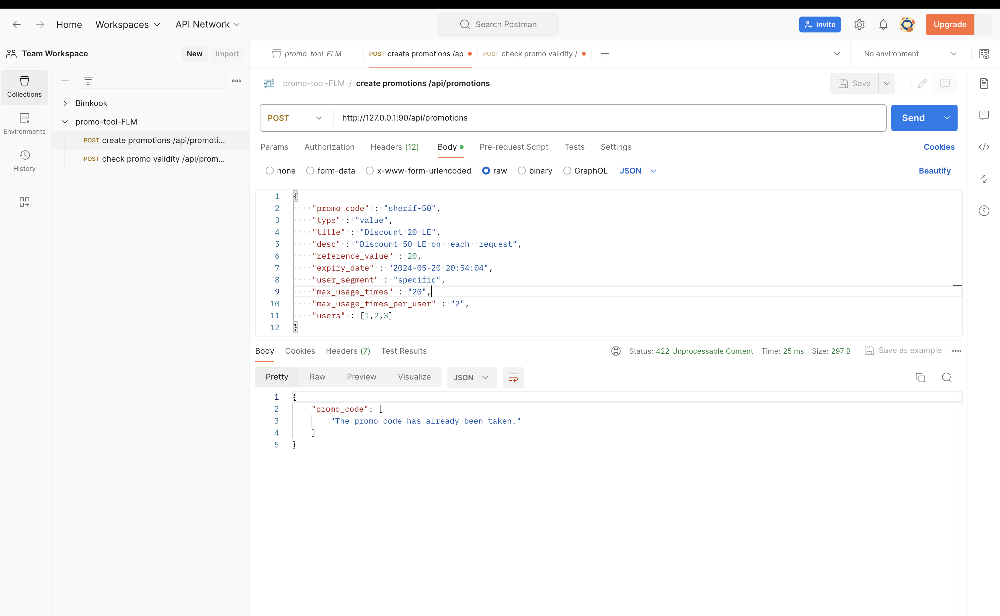
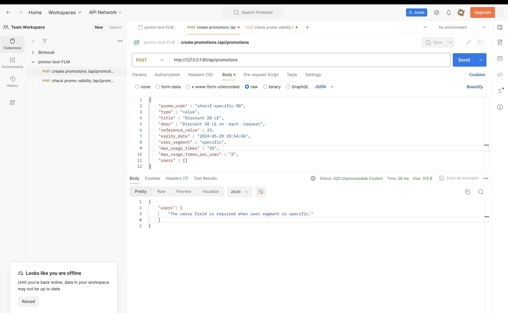
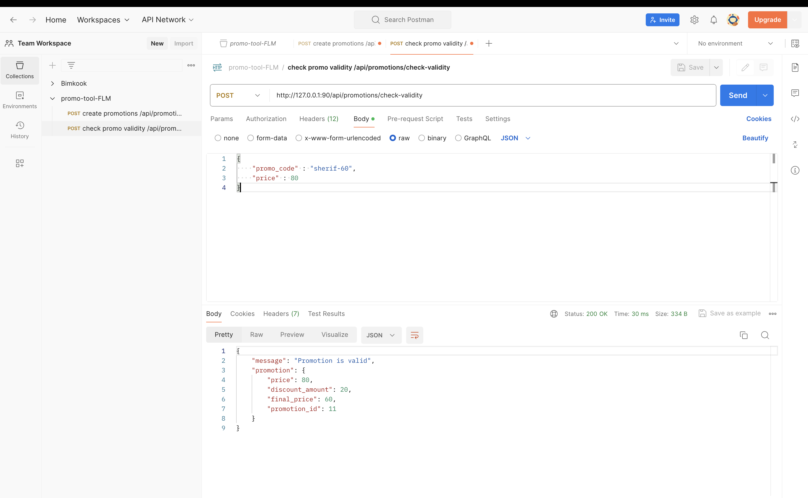
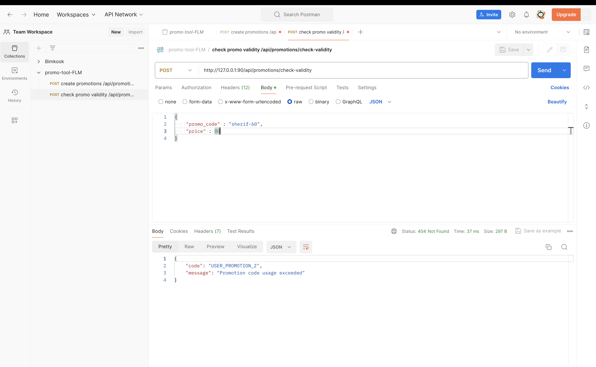
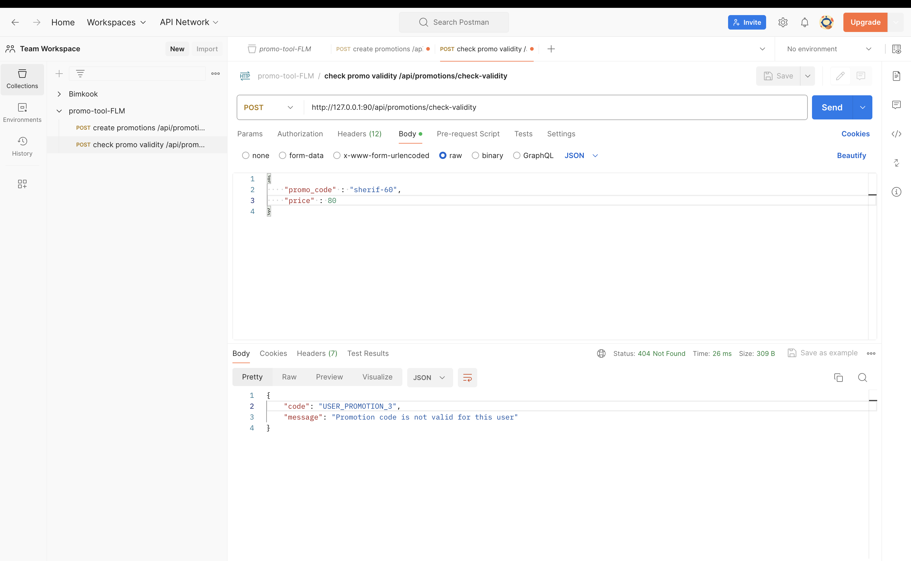

## Promo tool Food Lab Maker

THis task to Create a promo code app where admins can create promo codes through an api. the
app consists of 2 endpoints
    - promotion creation  API
    - Promotion Check validty API 

## prerequisites 
- Composer
- Laravel
- Docker
- Docker compose

## Installation
- Clone the repository: 
    - For ssh: git clone git@github.com:shrief60/promo-tool-FLM.git
    - For Https: git clone https://github.com/shrief60/promo-tool-FLM.git

- Then build Docker image and run the container
    - docker compose build
    - docker compose up

## Network Ports Configuration
    - MYSQL Port is : 8900

    - PHP server Port : 90

You can change these ports on your local environment if there are not available.

## Stack 
- Laravel
- PHP
- Docker

## Postman API Collection 

- https://crimson-crescent-13514.postman.co/workspace/Team-Workspace~13975cc8-9258-473a-8ed5-7cac31166281/collection/34705562-781aa902-5559-441b-ad8c-fe863bb1fe30?action=share&creator=34705562

## promotion Creation samples

Promotion creation successfully:

Promotion validation Error

promo_code already exists

Promotion Specific Validation

## Promotion Validty samples

Promotion Validty successfully:

Promotion exceeded usage times

promotion expired

Promotion not valid for this user

